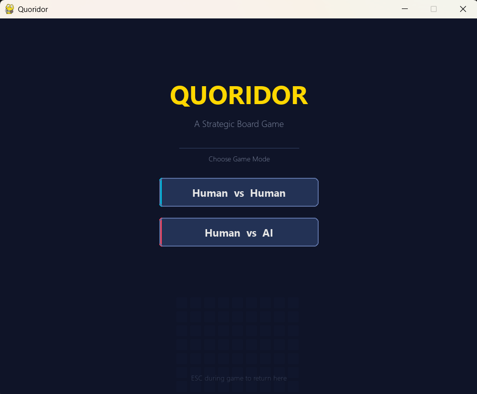
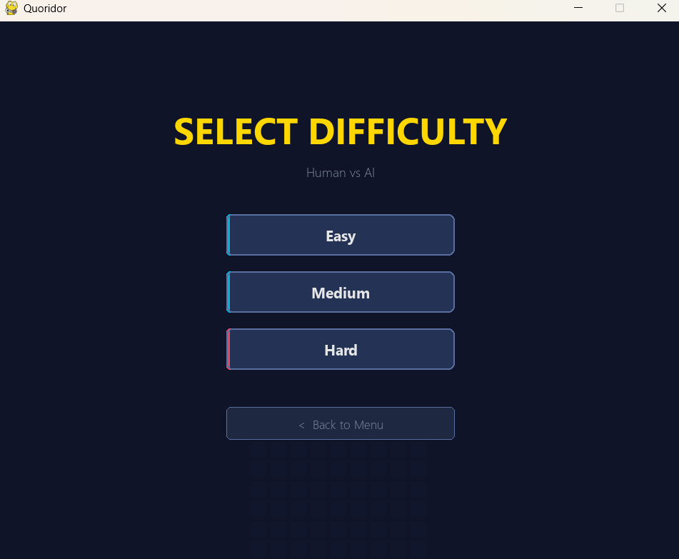
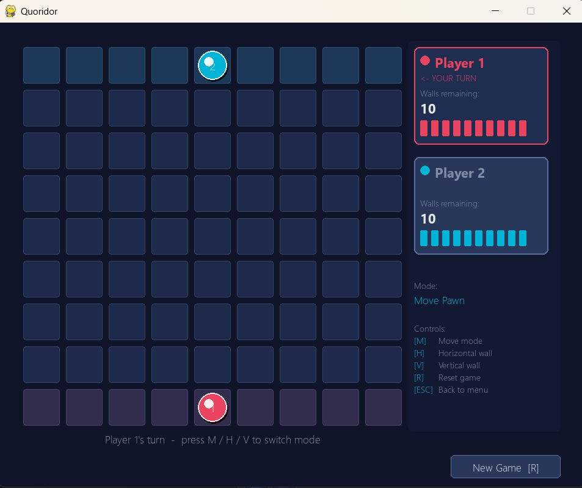
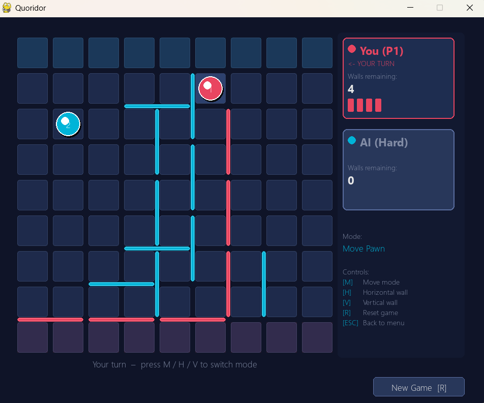
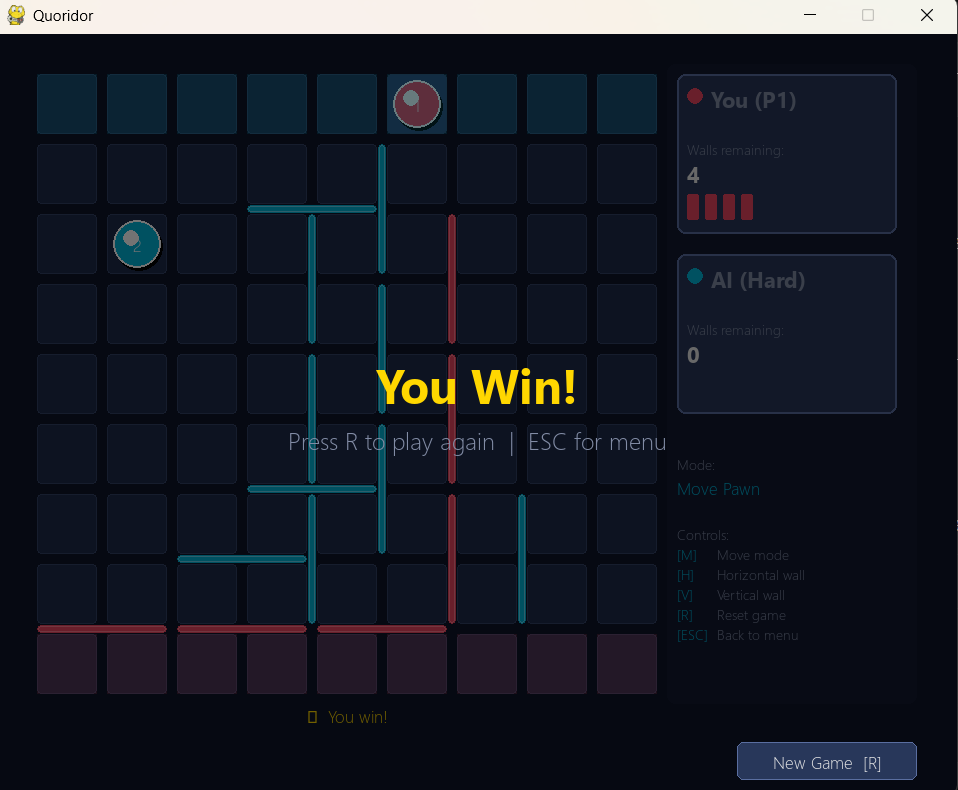

# ♟️ Quoridor Board Game

A complete, interactive, and feature-rich implementation of the classic abstract strategy board game **Quoridor**, built using **Python** and the **Pygame** library. Play against a friend locally or challenge a highly optimized AI opponent with multiple difficulty levels.

---

## 📖 Game Description

**Quoridor** is an abstract strategy board game played on a **9x9 grid** with two players. The objective is to navigate your pawn from your starting line to any cell on the opponent's starting line (the opposite side of the board). 

### 📜 Game Rules:
1. **Movement**: On your turn, you can move your pawn one square orthogonally (up, down, left, right).
2. **Jumping Opponents**: If you face an opponent's pawn directly and there is no wall behind them, you can jump over them to land on the cell behind them. If there is a wall behind them, you can jump diagonally to either side of their pawn.
3. **Wall Placement**: Instead of moving your pawn, you can place a wall. Walls span exactly 2 cells and block movement. Each player starts with **10 walls**.
4. **No Trapping Rule**: You are forbidden from placing a wall that completely blocks a player from reaching their goal line. There must always remain at least one valid path to the goal for both players.

---

## 🎬 Demo Video

🎥 Watch the gameplay demonstration in action here:  
👉 [**Google Drive Demo Video Link**](https://drive.google.com/file/d/1S-lsZt3tBzkVfntDMPqx_wnCKH3hs1AU/view?usp=sharing)

---

## 📸 Screenshots of the Game in Action

### 🖥️ Menu Interface
| Main Menu | AI Difficulty Menu |
|:---:|:---:|
|  |  |

### 🎮 Gameplay Stages
| Match Start | Tactical Wall Placement | Victory Screen |
|:---:|:---:|:---:|
|  |  |  |

---

## 🚀 Installation and Running Instructions

Follow these simple steps to set up and run the game locally on your machine:

### 1. Prerequisites
Ensure you have **Python 3.10** or higher installed on your computer. You can check your version using:
```bash
python --version
```

### 2. Setup Virtual Environment
Navigate to the project root directory and create a virtual environment to keep dependencies isolated:
```bash
# Create the virtual environment
python -m venv venv

# Activate on Windows (CMD/PowerShell)
venv\Scripts\activate

# Activate on macOS/Linux
source venv/bin/activate
```

### 3. Install Dependencies
Install the required Pygame library:
```bash
pip install pygame
```

### 4. Run the Game
Run the game using the main script in the `src/` directory:
```bash
cd src
python main.py
```

### 5. Running Tests (Optional)
To run the test suite, install `pytest` and execute it from the project root:
```bash
pip install pytest
pytest
```

---

## 🎮 Controls Explanation

The game uses keyboard inputs to switch modes and mouse clicks to perform actions.

### ⌨️ Keyboard Controls
* **`M`**: Switch to **Move Pawn Mode** (Default)
* **`H`**: Switch to **Horizontal Wall Mode**
* **`V`**: Switch to **Vertical Wall Mode**
* **`R`**: **Reset** the current game match
* **`ESC`**: Return to the **Main Menu** from an active game

### 🖱️ Mouse Interactions
* **In Move Mode**:
  1. Click your pawn to select it. Valid moves will highlight in **green**.
  2. Click on any green-highlighted cell to move your pawn there.
* **In Wall Mode (H/V)**:
  1. Move your cursor over the board. Valid wall positions will preview in **green**, and invalid positions in **red** (showing why it is invalid on the status bar).
  2. Left-click to place the wall on the board.

---

## 🤖 AI Opponent Specifications

The AI engine uses the **Minimax Algorithm** enhanced with **Alpha-Beta Pruning** and **Transposition Tables** to determine optimal moves.

* **Easy Difficulty**: Search depth of 2. Uses BFS heuristic logic. Ideal for beginners.
* **Medium Difficulty**: Search depth of 3. Uses a balanced path-length heuristic.
* **Hard Difficulty**: Search depth of 7. Uses highly optimized A* search and transposition caching for strategic wall blocking.

---

## 🏗️ Project Structure

```
Quoridor_Game/
├── src/
│   ├── main.py              # Entry point - game loop & menu navigation
│   ├── game/
│   │   ├── board.py          # Board state, wall storage & blocking logic
│   │   ├── game.py           # Turn management, win detection, AI integration
│   │   ├── player.py         # Player data (position, walls remaining)
│   │   ├── rules.py          # Move validation & wall placement rules
│   │   ├── pathfinding.py    # BFS to ensure no player gets trapped
│   │   └── wall.py           # Wall data class
│   ├── ai/
│   │   ├── ai_controller.py  # AI entry point - selects best move
│   │   ├── search.py         # Minimax with Alpha-Beta pruning
│   │   ├── evaluation.py     # Board evaluation / heuristic function
│   │   ├── config.py         # Difficulty configs (depth, weights)
│   │   ├── pathfinding.py    # A* pathfinding for AI evaluation
│   │   ├── wall_strategy.py  # Strategic wall placement logic
│   │   ├── move_ordering.py  # Move ordering for pruning efficiency
│   │   ├── hasher.py         # Zobrist-style board hashing
│   │   └── transposition.py  # Transposition table for caching
│   └── ui/
│       ├── constants.py      # Colors, sizes, layout constants
│       ├── renderer.py       # All rendering (menus, board, panels)
│       └── input_handler.py  # Mouse & keyboard input processing
├── tests/                    # Unit & integration tests
├── examples/                 # Demo scripts & benchmarks
├── docs/                     # Documentation
└── .gitignore
```

---
